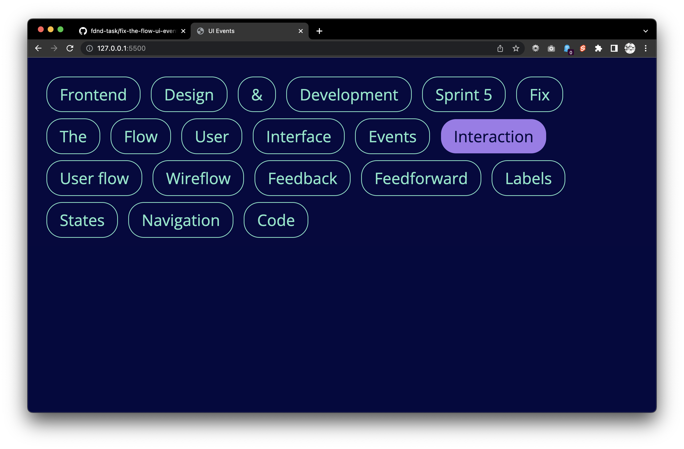

# Fix the Flow - User Interface Events

Een oefening in ui-events waarin je experimenteert met muis, keyboard, touch én apparaat interactie en de afhandeling daarvan doormiddel van javascript.

## Context

Deze deeltaak hoort bij sprint 5 Fix the Flow. Dit is een deeltaak die je individueel uitvoert en waarmee je een checkpoint bij je docent haalt.

In het college S05W2-01-User-Interface-Events wordt deze opdracht uitgelegd.

## Doel van deze opdracht

Op websites zijn veel verschillende vormen van interactie met gebruikers mogelijk. Deze worden *UI Events* genoemd en logischerwijs heet de verzameling van al die vormen van interactie de *UI Events API*. Als frontender wordt je geacht deze API te beheersen. In onderstaande afbeelding zie je 20 verschillende elementen, aan tenminste 10 daarvan ga jij gebruikers interactie toevoegen.

In deze opdracht experimenteer je met verschillende user interface events en gaandeweg leer je de mogelijkheden van de browser beter kennen.

## Werkwijze

Omdat deze deeltaak uit maximaal 20 kleinere taken (er zijn namelijk 20 elementen!) bestaat doorloop je telkens de development lifecycle. Je weet ondertussen dat je dit bij elke grotere opdracht meerdere malen doet.

Deze opdracht gaat over alle fases van de DLC: [analyseren](#analyseren), [ontwerpen](#ontwerpen), [bouwen](#bouwen), [integreren](#integreren) en [testen](#testen).

### Analyseren

Je onderzoekt kort welke interactie je nu gaat maken en denkt alvast na over hoe je dat zou kunnen doen.

#### Aanpak

1. (Eerste keer) Fork deze repository naar jouw eigen GitHub account;
2. Bedenk een interactie die aan de beurt is;
3. Bepaal de stappen die je neemt bij ontwerpen, bouwen, integreren en testen. Gebruik onderstaande bronnen om grip te krijgen op wat je aan het doen bent. 

#### Materiaal

- Video: [… if you only know one thing about JavaScript … @ CSS-Tricks](https://css-tricks.com/video-screencasts/150-hey-designers-know-one-thing-javascript-recommend/)
- Guide: [Mouse Events in Javascript @ Kirupa](https://www.kirupa.com/html5/mouse_events_in_javascript.htm)
- Guide: [Working with the Keyboard @ Kirupa](https://www.kirupa.com/html5/keyboard_events_in_javascript.htm)
- Guide: [Introduction to events @ MDN](https://developer.mozilla.org/en-US/docs/Learn/JavaScript/Building_blocks/Events)
- Reference: [QuerySelector @ MDN](https://developer.mozilla.org/en-US/docs/Web/API/Document/querySelector)
- Reference: [ClassList @ MDN](https://developer.mozilla.org/en-US/docs/Web/API/Element/classList) 
- Reference: [UI Events @ MDN](https://developer.mozilla.org/en-US/docs/Web/API/UI_Events)
- Reference: [DeviceMotionEvent @ MDN](https://developer.mozilla.org/en-US/docs/Web/API/DeviceMotionEvent)

### Ontwerpen

Maak een snelle schets welke je gebruikt om de interactie te implementeren.

#### Aanpak

1. Onderzoek hoe je de interactie zou kunnen maken met CSS en Javascript. Als je helemaal zonder ideeën zit kunnen onderstaande bronnen helpen.
2. Schets de interactie met goede labels, bedenk hoe je de gebruiker feedback / feedforward kunt geven
3. Maak een breakdown-schets waarin je bedenkt welke JS en CSS je nodig hebt.

#### Materiaal

- [Interactions: thinking & sketching them. @ UX-Planet](https://uxplanet.org/interactions-thinking-sketching-them-f3d4c1d11149)
- [How to Apply Disney’s 12 Principles of Animation to UI Design @ interaction-design.org](https://www.interaction-design.org/literature/article/ui-animation-how-to-apply-disney-s-12-principles-of-animation-to-ui-design?utm_campaign=evergreen&utm_source=linkedin&utm_medium=post&utm_content=article_post) (met dank aan @Ste_fanta)

### Bouwen

Implementeer de interactie door `/assets/script/main.js` en `/assets/style/style.css` aan te vullen met jouw code. N.B.: Denk telkens na over nieuwe `.class` en variabelen namen zodat je eerder gemaakte code niet breekt!

#### Aanpak

##### In HTML & CSS

1. Voeg tijdelijk een nieuwe class die de interactie goed beschrijft (bijvoorbeeld *bibberen*) toe aan een HTML element;
2. Schrijf in CSS de regels om de interactie werkend te maken;
3. Haal de tijdelijke class weer weg uit de HTML.

##### In Javascript

1. Bedenk een naam die nog niet in gebruik is en declareer die met `let`;
2. Selecteer met .js het juiste element uit de DOM met behulp van `document.querySelector()`;
3. Gebruik in .js `naam.addEventListener()` om een event aan een element te koppelen;
4. Gebruik in .js `naam.classList.toggle()` om een andere class aan een element toe te voegen.

ProTip: Gebruik bij elke stap `console.log()` om te controleren of alles werkt zoals je verwacht dat het werkt.

### Integreren

Voer een commit uit op jouw GitHub met de interactie die je zojuist geïmplementeerd hebt. Op deze manier kan je altijd terug naar een versie waarvan je weet dat alles in orde was.

#### Aanpak

1. Voer in GitHub een commit message in, gebruik de naam van de interactie die je zojuist geïmplementeerd hebt;
2. Verstuur de commit naar GitHub door te pushen;
3. Beschrijf in de wiki hoe je het implementeren van deze layout hebt aangepakt (bijvoorbeeld: ik heb met). Beschrijf ook wat er heel goed ging en wat lastig was;
Neem in je wiki een direct linkje naar de betreffende layout op.

### Testen

#### Aanpak

Opdracht: Experimenteer met User Interface Events.

Ontwerp en bouw een User Interface voor verschillende gebruikersinput. Zorg voor goede feedback / feedforward en labels zodat een gebruiker weet wat er mogelijk is …

Probeer een aantal van onderstaande experimenten te maken:

* Gebruik de _eventListener_ met een “click” event om de kleur van de knoppen te veranderen. 
* Gebruik een “dubbel click” event om de kleur van de knoppen te veranderen. 
* Gebruik het “keydown” event om kleuren van knoppen te veranderen.
* Probeer een “Long press” event te maken om een kleur aan te passen.
* Kun je nog een ander _Event_ gebruiken om de de kleur van knoppen veranderen? Bijvoorbeeld "Devicemotion"? Of "Drag and drop"?

## Criteria

Focus sprint 5 - De focus van deze sprint ligt op interactie en informatie architectuur van een website.

Doel van deze opdracht:

* Je leert hoe je verschillende User Interface Events kan gebruiken met Javascript.

Deze deeltaak hoort bij het gedragscriterium:

* Methodisch handelen: Student past aangeboden principes en conventies op het gebied van frontend, interface design en vormgeving toe.

Deze opdracht is done als:

- [ ] Je hebt minstens tien interactie experimenten in code geïmplementeerd;
- [ ] Alle schetsen voor interacties zijn opgenomen in je wiki;
- [ ] Bij elke schets staat een korte beschrijving van de interactie;
- [ ] Je werk is te bekijken via GitHub pages;

(extra credits!)

- [ ] Je hebt interactie experimenten voor alle twintig elementen geïmplementeerd;
- [ ] Je hebt ingewikkelde device-orientation events geïmplementeerd;

(eeuwige roem)

- [ ] Je hebt een shake interactie geïmplementeerd waarmee alle elementen in het scherm naar beneden vallen;
- [ ] De shake interactie werkt in zowel landscape als portrait oriëntatie.

